# Portfolio Performance Narrative Analysis

A Python-based RAG system that analyzes multi-currency portfolio performance and generates professional narratives explaining key market drivers from September 30 to October 24, 2025.

## Workflow



## Overview

This system analyzes a 7-position portfolio across US and international equities, calculating performance attribution by position, sector, and currency. It retrieves relevant market context using a RAG (Retrieval-Augmented Generation) pipeline and generates a 6-10 sentence narrative with proper source citations.

**Key Features:**
- Multi-currency portfolio analysis with FX decomposition
- RAG implementation using ChromaDB and OpenAI embeddings
- News retrieval from Finnhub and MarketAux APIs (*Yahoo Finance unavailable*)
- LLM-generated narratives with inline citations
- Automated testing against reference solutions

## Portfolio Data

**Period:** September 30 → October 24, 2025  
**Positions:** 7 holdings across multiple asset classes

- **US Equities (USD):** CAT, IBM, HD, JPM
- **International Equities:** NESN.SW (CHF), AZN.L (GBP), OR\.PA (EUR)
- **Sectors:** Industrials, Technology, Consumer Discretionary, Financials, Consumer Staples, Health Care

## Results Summary

**Portfolio Return:** +8.81% ($146,380 profit)

**Top Contributors:**
1. NESN.SW: +$90,670 (82.72% return, FX contribution: 66.67%)
2. OR\.PA: +$49,924 (16.93% return, FX contribution: 15.00%)
3. CAT: +$36,619 (9.87% return, FX contribution: 0.00%)

**Top Detractors:**
1. AZN.L: -$23,853 (-13.54% return, FX contribution: -22.86%)
2. HD: -$13,327 (-4.57% return, FX contribution: 0.00%)
3. JPM: -$10,098 (-4.29% return, FX contribution: 0.00%)

## Generated Narrative

The portfolio gained **8.81%** from **September 30 to October 24, 2025**, generating **$146,380** in profit.

**Nestlé SA-REG (NESN.SW)** was the largest contributor, advancing **82.72%** and adding **$90,670** to portfolio value following the new CEO's turnaround plan, including **16,000 global job cuts** and an increased **CHF 3 billion** cost-savings target that buoyed shares; performance was driven by a **9.63% local return** and a substantial **66.7% FX tailwind** [1][2][3].

**L'Oréal (OR\.PA)** was a significant contributor, rising **16.93%** and adding **$49,924** as investors welcomed resilient nine-month sales of **€32.8 billion** and the **acquisition of Kering's beauty unit**, which strengthens its premium portfolio; the move reflected a **1.68% local gain** supplemented by a **15.0% FX boost** [4][5][6].

**Caterpillar Inc. (CAT)** contributed **9.87%**, adding **\$36,619**, as investors positioned ahead of **Q3 results** and the upcoming **Investor Day webcast** detailing strategic priorities and long-term growth opportunities [7][8][9].

On the downside, **AstraZeneca PLC (AZN.L)** was the primary drag, declining **13.54%** and reducing portfolio value by **\$23,853**; despite a maintained **Buy rating** with a **£140 price target** and supportive headlines around sentiment, the stock rose **12.07% locally** but was more than offset by unfavorable **currency movements (-22.9%)** [10][11][12].

**Home Depot Inc. (HD)** fell **4.57%**, trimming **\$13,327** from returns; despite its reputation as a reliable dividend compounder and the completed **$5.5 billion acquisition of GMS Inc.** via SRS Distribution, shares softened into a sluggish housing backdrop [13][14][15].

**JPMorgan Chase & Co. (JPM)** declined **4.29%**, detracting **\$10,098**, even as **Q3 results** featured solid revenue growth and beats amid resilient markets and consumer banking, suggesting valuation and expense/credit headwinds capped the stock [16][17][18].

Overall, a heavy tilt to **Consumer Staples (34.8%)** drove gains—amplified by **CHF and EUR strength**—while **GBP weakness** hurt AstraZeneca's contribution; **Industrials exposure** benefited from pre-earnings optimism in heavy equipment, and **currency dynamics** were a key performance differentiator over the period.

### Sources

**[1]** Nestlé announces 16000 job cuts worldwide over next two years - lemonde.fr | [Link](https://www.lemonde.fr/en/economy/article/2025/10/16/nestle-announces-16000-job-cuts-worldwide-over-next-two-years_6746475_19.html)  
**[2]** Nestle to cut 16000 jobs as new CEO ignites turnaround fire - reuters.com | [Link](https://www.reuters.com/business/nestle-reports-better-than-expected-sales-growth-with-new-ceo-helm-2025-10-16/)  
**[3]** Nestlé to cut thousands of jobs worldwide over next two years - swissinfo.ch | [Link](https://www.swissinfo.ch/eng/agribusiness/nestl%C3%A9-cuts-thousands-of-jobs/90175085)  
**[4]** Sales at 30 September 2025: group sales €32.8 bn - Loreal | [Link](https://www.loreal.com/en/press-release/finance/sales-at-september-30-2025/)  
**[5]** L'Oréal to acquire Kering's beauty unit for €4 billion - Reuters | [Link](https://www.reuters.com/business/kering-sell-beauty-unit-loreal-466-billion-2025-10-19/)  
**[6]** Kering and L'Oréal forge an alliance in beauty and wellness - Kering | [Link](https://www.kering.com/en/news/kering-and-l-oreal-forge-an-alliance-in-beauty-and-wellness/)  
**[7]** Caterpillar's Quarterly Earnings Preview: What You Need to Know - Yahoo | [Link](https://finnhub.io/api/news?id=327e53308ca7a97b5cd8775dc6034a6a291e86bdfdfded0e5485ca5fc7ed422e)  
**[8]** Earnings Preview: Caterpillar (CAT) Q3 Earnings Expected to Decline - Yahoo | [Link](https://finnhub.io/api/news?id=b52a95a9d4b75bb73ad51cbbbfed011013edef42f011e2f9631421255bb33c05)  
**[9]** Caterpillar Inc. to Offer Video Webcast of 2025 Investor Day - Yahoo | [Link](https://finnhub.io/api/news?id=70a6642109ba61f34a7e286d820e9d68c7c7ab8bfa96bf8c027cae626f1d58e8)  
**[10]** J.P. Morgan Maintains a Buy Rating on AstraZeneca PLC (AZN), Sets a £140 PT - finance.yahoo.com | [Link](https://finance.yahoo.com/news/j-p-morgan-maintains-a-buy-023546127.html)  
**[11]** AstraZeneca (AZN) Jumps to All-Time High on Trump Drug Tariff Delay - finance.yahoo.com | [Link](https://finance.yahoo.com/news/astrazeneca-azn-jumps-time-high-074855557.html)  
**[12]** J.P. Morgan Maintains a Buy Rating on AstraZeneca PLC (AZN), Sets a £140 PT - Insider Monkey | [Link](https://www.insidermonkey.com/blog/j-p-morgan-maintains-a-buy-rating-on-astrazeneca-plc-azn-sets-a-140-pt-1631686/)  
**[13]** The Home Depot's (HD) Steady Cash Flows Keep it on the List of Promising Dividend Stocks to Watch - Yahoo | [Link](https://finnhub.io/api/news?id=662c35680aac9188735bc3d361ac11dff487369f0aa1a4fcff0e654b2a38dc58)  
**[14]** Home Depot (HD): A Reliable Dividend Stock with Strong Profitability - Yahoo | [Link](https://finnhub.io/api/news?id=e2415c024ea0c80ed43475ab676d7eb206f856248a3ec2640b447a3e26b34f42)  
**[15]** The Home Depot, Inc. (HD) Successfully Acquires GMS Inc. for $5.5 Billion - Yahoo | [Link](https://finnhub.io/api/news?id=ab32f62942ca54d29d2ff284ffd5c921159748dc95ab4e7f452659acf73c3071)  
**[16]** JPMorgan Chase & Co (JPM) Q3 2025 Earnings Call Highlights: Strong Revenue Growth Amid ... - Yahoo | [Link](https://finnhub.io/api/news?id=b262eff1096b6d9a44e061a935862fe33c7c361aca940b3c1dc7ee8fa652bf2f)  
**[17]** JPMorgan Chase (JPM): Evaluating Valuation After Strong Q3 Earnings and Landmark New Headquarters Opening - Yahoo | [Link](https://finnhub.io/api/news?id=fff69b6d787fd1c9d7af4c4f21b17e79407ca0a25cbf8042479daa427f3c574f)  
**[18]** JPM Q3 Deep Dive: Markets Revenue and Consumer Resilience Drive Results Amid Credit and Expense Headwinds - Yahoo | [Link](https://finnhub.io/api/news?id=5adf3d4443aad11f6ed024d3c41e3ea4f873ac40864315e5607184b2b0f87e2a)


## Installation

### Prerequisites
- Python 3.8+
- OpenAI API key
- Finnhub API key
- MarketAux API key

### Setup

1. **Clone repository:**
```bash
git clone https://github.com/radubauzh/Portfolio-Performance-Analysis.git
cd Portfolio-Performance-Analysis
```

2. **Install dependencies:**
```bash
pip install pandas openpyxl chromadb openai python-dotenv requests beautifulsoup4 lxml nltk tabulate
```

3. **Configure API keys:**

Create a `.env` file in the project root:
```
OPENAI_API_KEY=your_openai_key_here
OPENAI_MODEL=gpt-4o
FINNHUB_API_TOKEN=your_finnhub_token_here
MARKETAUX_API_TOKEN=your_marketaux_token_here
```

4. **Download NLTK data:**
```python
import nltk
nltk.download('punkt')
nltk.download('punkt_tab')
```

## Usage

### Run Complete Analysis

Open and execute `main.ipynb` to:
1. Calculate portfolio performance metrics
2. View top contributors/detractors
3. Analyze sector breakdowns
4. Run validation tests
5. Display generated narrative

### Generate New Narrative

```python
from portfolio_analyzer import PortfolioAnalyzer

analyzer = PortfolioAnalyzer("data/PortfolioPositions_Updated.xlsx")
narrative = analyzer.generate_narrative()
print(narrative)
```

Output saved to `results/portfolio_narrative.txt`

### Fetch Fresh News Data

```python
from get_news import fetch_and_save_news

fetch_and_save_news(
    tickers=["NESN.SW", "OR.PA", "CAT", "AZN.L", "HD", "JPM"],
    date_from="2025-09-30",
    date_to="2025-10-24"
)
```

News saved to `data/news/{TICKER}_news_{dates}.csv`

## Technical Implementation

### Architecture

**1. Portfolio Analysis** (`portfolio_analyzer.py`)
- Loads Excel data with proper currency handling
- Calculates position-level P&L in USD
- Decomposes returns into local vs. FX components
- Computes weighted sector performance
- Ranks positions by absolute dollar contribution

**2. News Retrieval** (`get_news.py`)
- Fetches news from Finnhub and MarketAux APIs as yahoo finance is rate limited
- Scrapes full article text and metadata with BeautifulSoup
- Scores articles by relevance (keyword (stemmed) + company name matching) <- this could be further improved
- Exports all articles with a relevance score bigger than 0.1 to csv

**3. RAG Pipeline** (`portfolio_analyzer.py`)
- Embeds news articles using OpenAI `text-embedding-3-large`
- Stores vectors in ChromaDB (persistent on disk)
- Retrieves top 3 relevant articles per position via semantic search
- Passes context to LLM for narrative generation

**4. Narrative Generation**
- Constructs structured prompt with performance data + news context
- Calls OpenAI API (supports GPT-4 and GPT-5 reasoning models)
- Formats output with inline citations and source list
- Saves to `results/portfolio_narrative.txt`

### Key Design Decisions

**FX Decomposition:**  
Separates local price returns from currency effects to explain international holdings accurately. Critical for explaining positions like AZN.L (+12% local, -23% FX = -13.5% total).

**Start Position Weighting:**  
Uses beginning-of-period positions to calculate pure performance attribution, excluding intraperiod flows.

**Weighted Returns:**  
Portfolio and sector returns use proper weighted averaging, not simple arithmetic means.

**Relevance Scoring:**  
Custom algorithm prioritizes:
- Company name mentions (15 pts)
- High-value keywords (stemmed): earnings, M&A, executives (25 pts title, 15 pts summary)
- Medium-value keywords (stemmed): revenue, growth, outlook (10 pts title, 6 pts summary)

**Persistent Vector Store:**  
ChromaDB embeddings saved to `data/chroma_db/` to avoid re-embedding on each run.

## Data Sources

### News APIs

**Yahoo Finance:** Unavailable for this task due to rate limiting issues.
**Finnhub:** Primary source for US equities (CAT, HD, JPM, AZN.L)  
**MarketAux:** Supplementary source for all other tickers  

**Note on NESN.SW and OR\.PA:**  
Limited API coverage for Swiss/French tickers. Key articles manually sourced from company press releases and major financial news sites (Reuters, Le Monde, Swissinfo).

### Portfolio Data

`data/PortfolioPositions_Updated.xlsx` contains:
- Security ticker, name, sector, currency
- Start/end prices and positions
- Exchange rates to USD

## Validation

Run automated tests to verify calculations:

```python
from tests import run_tests
run_tests()
```

Tests compare calculated values against hand-computed reference solutions in `data/solution/` for:
- Top contributors P&L and returns
- Top detractors P&L and returns
- Sector breakdowns

Expected output:
```
Top Contributors: ✅ match
Top Detractors: ✅ match
Sector Breakdown: ✅ match
----------------------------------------
✅ All calculated values match the hand-computed reference solutions within tolerance.
```

## Project Structure

```
├── portfolio_analyzer.py       # Core analysis + RAG pipeline
├── get_news.py                 # News fetching + scraping
├── tests.py                    # Validation tests
├── main.ipynb                  # Full workflow notebook
├── data/
│   ├── PortfolioPositions_Updated.xlsx
│   ├── news/                   # Scraped articles per ticker
│   ├── chroma_db/              # Persistent vector store
│   └── solution/               # Reference calculations
└── results/
    └── portfolio_narrative.txt # Generated narrative
```

## Production Considerations

### 1. Scalability
- **Current:** 7 positions, ~50 articles, single-threaded
- **Production:** Batch embeddings (e.g. group many articles per request), parallel API calls, rate limit handling, and streaming (e.g. process data in chunks and deliver results progressively) for large portfolios

### 2. Data Quality
- **Current:** Best-effort web scraping with fallbacks
- **Production:** Premium news APIs (Bloomberg, FactSet), structured data feeds, real-time updates

### 3. RAG Enhancements
- **Reranking:** Add cross-encoder (e.g. re-score top-K retrieved articles by jointly comparing query and text) for better context selection beyond basic semantic similarity
- **Hybrid search:** Combine semantic search with keyword filters (date range, sentiment, event type)
- **Agentic workflow:** Let LLM request additional context if initial retrieval insufficient

### 4. LLM Selection

| **Aspect**               | **Off-the-Shelf Models**                     | **Fine-Tuned Models**                  |
|--------------------------|--------------------------------------------|------------------------------------------|
| **Setup Time**           | Immediate                                  | Weeks to months                          |
| **Cost**                 | Pay-per-use (API-based)                    | High upfront cost, lower inference cost  |
| **Performance**          | General-purpose, good for diverse tasks    | Optimized for specific financial tasks   |
| **Flexibility**          | High (supports multiple use cases)         | Limited to trained domain/task           |
| **Maintenance**          | None (handled by provider)                 | Requires retraining for new data         |
| **Best Use Case**        | Prototyping, small-scale production        | Large-scale production, domain-specific  |

### 5. Monitoring
- Add performance metrics (e.g., P&L attribution accuracy and sector return validation).
- Log RAG retrieval quality, including citation relevance scores and semantic similarity thresholds.
- Verify that citations in the narrative match retrieved source chunks and flag missing or low-confidence citations.
- Track LLM output consistency, detect hallucinations, and flag unsupported claims for manual review.
- Implement error logging and dashboards to monitor system performance and identify bottlenecks in real-time.

## License

MIT License - See `license` file for details.

## Author

Rafael Dubach  
GitHub: [@radubauzh](https://github.com/radubauzh)
LinkedIn: [Rafael Dubach](https://www.linkedin.com/in/rafael-dubach/)